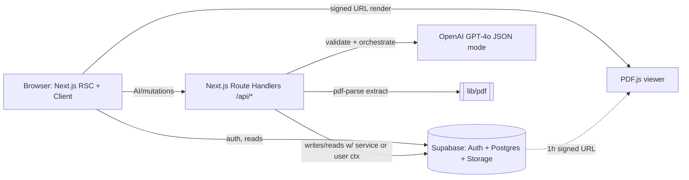

# ContractIQ — Engineering Document (High-Level Design)

**Status:** Draft for approval (Stage 1)
**Source PRD:** `docs/ContractIQ_PRD.md` (v1.0, 24 Jun 2026)
**Design System:** `docs/design.md` (allNeurons)
**Author:** Engineering
**Date:** 13 Jul 2026

> This document is the **authoritative engineering reference** for ContractIQ. No implementation begins until it is approved. Downstream stages read from it: `implementation-specs` (SQL + `.env.example` + granular specs) → `security-foundation` (RLS + `lib/security/`) → `frontend-setup` (Next.js scaffold) → feature build.

### Locked architectural decisions

| Decision | Choice | Rationale |
|---|---|---|
| Frontend | Next.js 14 (App Router) + React 18 + Tailwind CSS | Fixed by workflow; PDF.js compatible; RSC for fast reads |
| Backend layer | **Next.js Route Handlers** (`app/api/*`) on Vercel | Co-located, one deploy target, OpenAI key server-only. No Supabase Edge Functions |
| Language | **TypeScript** end-to-end | Type-safe OpenAI JSON schemas, DB row types, API contracts. Overrides the frontend-setup skill's `.jsx` default — scaffold must be initialised with TypeScript |
| BaaS | Supabase (Auth email/password, Postgres, Storage) | Managed Postgres + Auth + Storage + RLS in one project |
| LLM | OpenAI GPT-4o, JSON mode | Best legal-text reasoning; structured output |
| PDF | pdf-parse (server extract) + PDF.js (client viewer) | Text-layer only at MVP |
| Billing | **Deferred to Future Enhancement** | Not in MVP user stories US-001..US-012 |
| Chat delivery | **Request/response + persist** | Full contract + full history per turn; ≤15s target; no streaming at MVP |
| Hosting | Vercel (web + API routes) | Zero-config, autoscale |

---

## 1. Executive Summary

**Project:** ContractIQ — an AI-assisted contract review web app for NDAs and MSAs.

**Business goal:** Reduce single-contract review time from a manual baseline of **90 minutes to ≤ 15 minutes**, without requiring a lawyer, for SMBs and freelancers who lack in-house legal counsel.

**Problem statement:** Business professionals routinely sign NDAs/MSAs they don't fully understand. Manual review is slow (90–120 min), needs legal expertise, and misses material obligations (auto-renewal, indemnification caps, IP assignment). Generic AI tools give unstructured summaries with no page reference, confidence score, or contract-type-specific schema.

**Solution:** Upload a PDF → server extracts text → GPT-4o extracts the 10–30 terms that matter per contract type, each with a **value, page number, confidence score, and verbatim source sentence** → user reviews in a two-panel results view (PDF/text viewer + key-terms panel), corrects terms inline, and **chats with the contract** using answers grounded strictly in the document.

**Target users:** (1) Time-Pressed Founder / Ops Lead at a 5–250-person company with no legal team; (2) Freelancer / Consultant signing client MSAs. See §3.

**Success criteria (from PRD §3, §5, §10):**

| Metric | Target | How measured |
|---|---|---|
| North Star — upload → review complete | ≤ 15 min | Session logs |
| Key-term extraction accuracy | ≥ 88% F1 (NDA), ≥ 85% F1 (MSA) | Offline eval suite |
| Time to first key-term display | ≤ 30 s P95 (≤ 20-page contract) | Server timing logs |
| Confidence calibration error | ≤ 0.10 | Monthly calibration curve |
| Page-number accuracy | ≥ 92% | Eval suite |
| Chat groundedness | ≤ 5% hallucinated responses | Monthly expert review |
| Chat latency | ≤ 15 s P95 | Server timing logs |
| Cost per analysis | ≤ $0.25 (extraction ≤ $0.20) | OpenAI usage dashboard |
| Correction rate | ≤ 12% of terms | `corrections / total_extracted` |

---

## 2. Product Scope

### In scope (MVP — maps to v0.1–v1.0 in PRD roadmap)
- Email/password auth (Supabase Auth); private per-user data.
- PDF upload: **text-layer only, ≤ 10 MB, ≤ 20 pages, ≤ 15,000 tokens**; NDA or MSA; English (US/UK law).
- Server-side text extraction **once at upload** with `[PAGE N]` markers, stored in `contracts.contract_text`.
- Standard key-term extraction per contract type (NDA ~10 terms, MSA ~12 terms) via GPT-4o.
- **Custom key terms** (≤ 5 per analysis) added before processing.
- Per-term output: name, value, **page number**, **confidence score (colour-coded)**, **source sentence** ("Why?").
- Low-confidence (< 50%) warning flag; term never hidden.
- Results view: **PDF.js viewer** (primary) with **paginated text-viewer fallback** (when Storage unavailable); click-to-navigate by page.
- **Inline term editing** with "Edited" badge; original AI value preserved.
- **Chat with contract** — grounded in document text, mandatory `[Page X]` citation, persistent history.
- **Dashboard** — totals, breakdown by type, sortable contract history.
- **Feedback** — thumbs up/down + optional comment.
- Contract + all associated data deletable by user.
- Security: RLS on all tables, signed URLs (1 h expiry), rate limiting, prompt-injection guard (delivered in Stage 3).

### Out of scope (MVP)
- Scanned / image PDFs and OCR.
- Non-English contracts; non-US/UK jurisdictions.
- **Billing / subscriptions / quota enforcement** (deferred — see below).
- Batch upload; export (CSV/PDF); contract comparison; team/multi-user workspaces; email notifications.
- Fine-tuned models; chunked/vector RAG.

### Future enhancements (from PRD roadmap v1.1–v1.2 + pricing)
- **Billing:** Free Trial / Starter / Growth / Pro tiers (Stripe) + usage metering — *directional only in PRD; deferred.*
- Export key terms to CSV / results summary to PDF (v1.1).
- Batch upload up to 5 contracts; dashboard analytics charts (v1.1).
- Scanned-PDF OCR (AWS Textract); side-by-side contract comparison; email notifications; multi-user workspaces (v1.2).
- Chunked RAG once contract length limits are raised.

---

## 3. User Personas

| Persona | Role / Context | Permissions | Primary workflow |
|---|---|---|---|
| **Time-Pressed Founder / Ops Lead** (primary) | Founder/COO/Procurement/Legal-Ops at 5–250-employee SaaS/agency/fintech; no in-house counsel; signs 5–15 NDAs/MSAs per month | Authenticated user; **own data only** (RLS) | Upload → review key terms → correct → chat → dashboard history |
| **Freelancer / Consultant** (secondary) | Design/marketing/dev/consulting; receives 1–4 MSAs/month from larger clients; can't afford legal review | Authenticated user; own data only | Upload MSA → identify non-standard/risky clauses → chat |

**Roles model:** Single role (`authenticated user`) at MVP. There is no admin UI. Authorization is enforced entirely by Supabase **Row Level Security** keyed on `auth.uid() = user_id`. No custom auth middleware layer (PRD Assumption 9 — to be verified in Stage 3 security review).

---

## 4. User Flows

Format: `User Action → Frontend Behavior → Backend Processing → Database Interaction → System Response`

### Flow 1 — New Visitor → Sign Up → Dashboard (FR-01, US-001)
```
Land on marketing page → see value prop + "Get Started Free"/"Sign In" CTAs → no backend → no DB → static page
Click "Get Started Free" → open sign-up form (email+password) → Supabase Auth signUp → auth.users row + profiles row (trigger) → email verification, then redirect /dashboard
Login success → redirect → GET dashboard data → SELECT contracts WHERE user_id = auth.uid() (empty) → empty state: "No contracts reviewed yet — upload your first contract to begin"
```

### Flow 2 — Returning User → Dashboard (FR-10, US-008)
```
Click "Sign In" → email+password form → Supabase Auth signInWithPassword → session tokens set (cookies) → redirect /dashboard
Dashboard load → RSC fetch → SELECT count + type breakdown + last contracts WHERE user_id → summary card (total processed, NDA/MSA split, last 5 with status+date) + "Review a Contract" CTA
```

### Flow 3 — Core Flow: Contract Review (US-002..US-005, US-009, FR-02..FR-05, FR-11)
```
Click "Review Contract" → contract-type dropdown (NDA/MSA) + dropzone → no backend yet
Select type + drop PDF (≤10MB/≤20pp) → client-side size/type pre-check → POST /api/contracts/upload (multipart) →
  server: validate → pdf-parse extract text w/ [PAGE N] → count pages/tokens → guard (<100 words = scanned reject; >15k tokens reject) →
  INSERT contracts (status='uploaded', contract_text, page_count, token_count) → non-blocking Storage upload to contracts/{uid}/{cid}/{file}.pdf (file_path or null) →
  return contract row → show pre-processing preview (standard terms for the type)
Add custom terms (≤5) via "+ Add Key Term" → local state; badge "Custom" → (persisted on process)
Click "Process Contract" → 3-step progress (extract→analyse→compile) → POST /api/contracts/[id]/process →
  server: UPDATE status='processing' → build few-shot prompt (standard + custom terms) → GPT-4o JSON call (temp 0.1) → parse (1 retry) →
  INSERT custom_key_terms + key_terms (value, page, confidence, source_sentence) → UPDATE status='complete' →
  return terms → Results page (two-panel)
Results page → left: PDF.js viewer (signed URL) OR text-viewer fallback; right: key-terms list (name | value | page | confidence colour-coded) →
  low confidence <50%: ⚠️ + non-dismissible tooltip; "Why?" expands source_sentence
Click a term's page number → viewer scrolls to page (targetPage prop) with highlight
Click a term value → inline edit → PATCH /api/key-terms/[id] (saves value, is_edited=true, keeps original_ai_value) → "Edited" badge (≤2s)
```

### Flow 4 — Chat with Contract (US-007, US-012, FR-08, FR-09)
```
Results page → "Chat with Contract" tab/floating button → open chat panel → GET /api/contracts/[id]/chat → SELECT chat_sessions + chat_messages (asc, ≤200) → render history
Type question → POST /api/contracts/[id]/chat { message } →
  server: verify ownership → get-or-create chat_session → fetch full history (asc, ≤200) → classify query (contract/history/both) →
  GPT-4o call (temp 0.4) with system prompt "Answer only from the document text… else 'I cannot find this in the document'" + full contract_text + history →
  response must include [Page X] → INSERT chat_messages (user) + (assistant, page_citation) → return assistant message
Render assistant response (left-aligned) with "Source: Page X" link → click citation → viewer scrolls to page
```

### Flow 5 — Feedback (US-010, FR-12) — P2
```
Results page → thumbs up/down + optional comment → POST /api/feedback → INSERT user_feedback (rating, comment) → toast "Thanks for your feedback"
```

### Flow 6 — Delete Contract (constraints §5, GDPR)
```
Dashboard/results → Delete → confirm → DELETE /api/contracts/[id] → cascade delete key_terms/custom_key_terms/chat_sessions/chat_messages/user_feedback + Storage object → remove row from UI
```

---

## 5. Frontend Architecture

**Stack:** Next.js 14 App Router (TypeScript), React 18, Tailwind CSS, `@supabase/ssr` for auth-aware client/server clients, `pdfjs-dist` (react-pdf or direct PDF.js) for the viewer, `lucide-react` icons, `zod` for shared schemas.

**State management:** No global store at MVP.
- **Server Components** fetch data on the server (dashboard, results initial load) via the Supabase server client.
- **Client Components** hold local UI state (upload dropzone, custom-term list, inline edit, chat input) with `useState`/`useReducer`.
- Reads go directly through the Supabase browser client where convenient; all AI/mutating operations go through Route Handlers.
- Chat state is local component state seeded from the persisted history fetch.

### Route map (App Router)
```
/                         Landing (Server Component, static)
/login                    Sign in (Client)
/signup                   Sign up (Client)
/auth/callback            Supabase email-verification callback
/dashboard                Contract history + summary (Server Component, protected)
/review                   New contract: type select + upload + preview (Client, protected)
/contracts/[id]           Results: viewer + key-terms + chat (Server shell + Client panels, protected)
```
Protected routes are gated by a middleware/session check (helper `requireAuth()` delivered in Stage 3); unauthenticated users are redirected to `/login`.

### Component hierarchy
```
app/layout.tsx  (fonts: Inter Display; Tailwind globals; NotLegalAdvice footer w/ "Powered by OpenAI GPT-4o")
├─ (marketing)/page.tsx           Hero, value prop, demo, CTAs
├─ login / signup                  AuthForm
├─ dashboard/page.tsx
│   ├─ SummaryCard (totals, NDA/MSA breakdown)
│   ├─ ReviewContractCTA
│   └─ ContractTable (sortable: date|name|type|status; row → /contracts/[id])
├─ review/page.tsx
│   ├─ ContractTypeSelect (NDA|MSA)
│   ├─ PdfDropzone (client size/type pre-check)
│   ├─ KeyTermPreview (standard terms per type)
│   ├─ CustomTermInput ("+ Add Key Term", ≤5, "Custom" badge)
│   └─ ProcessButton → ProgressStepper (extract→analyse→compile)
└─ contracts/[id]/page.tsx  (two-panel)
    ├─ Left: DocumentViewer
    │    ├─ PdfViewer (PDF.js, signed URL, targetPage, zoom/scroll, highlight)
    │    └─ TextViewerFallback (parses [PAGE N], labelled sections, targetPage)
    ├─ Right: KeyTermsPanel
    │    └─ KeyTermRow (name | value | PageLink | ConfidenceBadge | WhyDisclosure | InlineEdit | EditedBadge)
    ├─ ChatPanel (tab/floating)
    │    ├─ MessageList (user right / assistant left, [Page X] link)
    │    └─ ChatInput
    ├─ FeedbackWidget (thumbs + comment)
    └─ NotLegalAdviceBanner (every results page)
```

### UX states (WCAG 2.1 AA — PRD §5)
- **Loading:** skeletons for dashboard/table; ProgressStepper for processing; spinner + disabled input while chat awaits.
- **Empty:** dashboard empty state; "no chat yet" prompt.
- **Error:** upload rejection (size/pages/scanned/token-limit) with specific message; OpenAI failure → "Try again in a few minutes" CTA (contract `status='error'`, retriable without re-upload); Storage failure → viewer hidden, text fallback shown, AI unaffected.
- **Low-confidence:** ⚠️ icon + non-dismissible tooltip; auto-highlight nearest page span.
- **Responsive:** two-panel collapses to stacked/tabbed on narrow screens; recommend desktop Chrome/Firefox; warn mobile on large files.
- **A11y:** keyboard-navigable, ARIA labels, colour-blind-safe confidence (icon + colour, not colour alone), tooltips for legal jargon.

### Design system binding (`docs/design.md` — allNeurons)
- **Typography:** Inter Display (all weights). H5 24/500/32; Paragraph Large 16/500/24; Paragraph Small 12/400/18.
- **Colour tokens:** Primary/brand `#115ACB`; text primary `#070A0E`, secondary `#4A4C4F`; background `#FFFFFF`, surface `#FAFAFA`, subtle `#F0F0F1`.
- **Confidence colour-coding:** green `#13A10E` (≥ 80%), amber `#FFAA33` (50–79%), red `#D13438` (< 50%).
- **Spacing:** 4px grid (8/16/24/32/40 most common). **Radius:** cards 8px, buttons 6px, tags 4px, inputs 6px, modals 12px. **Motion:** 150ms ease-out (micro), 250ms (modals). **Icons:** lucide-react at 18px / stroke 1.5.
- All UI code must apply `/design-system` and pull values from these tokens — no ad-hoc colours or off-grid spacing.

---

## 6. Backend Architecture

**Model:** Thin orchestration layer of Next.js **Route Handlers** (`app/api/*/route.ts`). No business logic beyond: auth check → input validation → (extraction/OpenAI/Storage orchestration) → DB write → typed response. The OpenAI key lives only in server env; it is never shipped to the client.

### Core systems
- **Auth / session:** `@supabase/ssr` server client reads the session from cookies; `requireAuth()` (Stage 3) returns the user or 401. RLS is the authoritative data-isolation layer.
- **Validation:** every route validates its body/params with **Zod** schemas (shared in `lib/validation/`), plus `validateFileUpload()` (Stage 3) for MIME/size checks.
- **OpenAI orchestration:** `lib/openai/` builds prompts, calls GPT-4o in JSON mode, parses with a single retry, and enforces token caps. Retries transient failures **3× with exponential backoff**; on exhaustion sets contract `status='error'` and surfaces a human-readable message.
- **PDF extraction:** `lib/pdf/extractText.ts` runs `pdf-parse` server-side, inserting `[PAGE N]` markers and counting pages/tokens. Runs **once at upload**; all downstream reads use the stored text.
- **Storage:** `lib/supabase/storage.ts` uploads to the `contracts` bucket (non-blocking) and mints 1-hour signed URLs for the viewer.
- **Rate limiting:** `rateLimiter.ts` (Stage 3) — sliding window via `rate_limit_events`, applied to upload/process/chat routes.
- **Prompt-injection guard:** `sanitizeForLLM()` (Stage 3) applied to user question + custom term names before they reach the model.
- **Error handling:** consistent `{ error: { code, message } }` envelope; never silent-fail on OpenAI (PRD §5).

### Service interaction



Text is extracted once at upload and stored in `contracts.contract_text`; the process and chat routes read from the DB — **neither re-downloads the PDF**. Storage is used only for the inline viewer and is non-blocking.

---

## 7. Database Design and Schema

Postgres on Supabase. **Every table** has `id uuid pk default gen_random_uuid()`, a `user_id uuid` FK → `auth.users(id)`, `created_at timestamptz default now()`, and **Row Level Security enabled** with `USING (auth.uid() = user_id)` on select/insert/update/delete (own-data-only). Tables with mutable rows also carry `updated_at timestamptz` maintained by an `updated_at` trigger.

Enums: `contract_type ∈ {nda, msa}`, `contract_status ∈ {uploaded, processing, complete, error}`, `message_role ∈ {user, assistant}`, `feedback_rating ∈ {up, down}`.

### `profiles`
Mirrors `auth.users`; created by an `on_auth_user_created` trigger.
| Column | Type | Notes |
|---|---|---|
| id | uuid PK | = auth.users.id |
| email | text | |
| created_at | timestamptz | |
RLS: user can select/update own row.

### `contracts`
Central record. One row per uploaded contract.
| Column | Type | Notes |
|---|---|---|
| id | uuid PK | |
| user_id | uuid FK → auth.users | RLS key |
| filename | text | original file name |
| contract_type | contract_type | nda \| msa |
| file_path | text NULL | `contracts/{uid}/{cid}/{file}.pdf`; **null if Storage upload failed** |
| contract_text | text | extracted text with `[PAGE N]` markers (source of truth) |
| page_count | int | ≤ 20 enforced |
| token_count | int | ≤ 15,000 enforced |
| status | contract_status | uploaded → processing → complete \| error |
| created_at / updated_at | timestamptz | trigger on update |
Indexes: `(user_id, created_at desc)` for dashboard; `(user_id, contract_type)` for breakdown.

### `key_terms`
Extracted terms (standard + custom results).
| Column | Type | Notes |
|---|---|---|
| id | uuid PK | |
| contract_id | uuid FK → contracts (on delete cascade) | |
| user_id | uuid FK | RLS key (denormalised for RLS simplicity) |
| term_name | text | e.g. "Governing Law" |
| value | text | extracted value (current, may be edited) |
| page_number | int | 1-indexed |
| confidence_score | numeric(4,3) | 0.000–1.000 |
| source_sentence | text | verbatim sentence ("Why?") — required |
| is_custom | boolean default false | true if from a custom term |
| original_ai_value | text NULL | set when user edits; preserves AI original |
| is_edited | boolean default false | drives "Edited" badge |
| created_at / updated_at | timestamptz | |
Index: `(contract_id)`.

### `custom_key_terms`
User-requested custom terms captured before processing (≤ 5).
| Column | Type | Notes |
|---|---|---|
| id | uuid PK | |
| contract_id | uuid FK → contracts (cascade) | |
| user_id | uuid FK | RLS key |
| term_name | text | requested term |
| is_manual | boolean default true | per FR-05 |
| created_at | timestamptz | |
Constraint: enforce ≤ 5 per contract at the application layer (documented for Stage 2/3).

### `chat_sessions`
One session per contract (created lazily on first message).
| Column | Type | Notes |
|---|---|---|
| id | uuid PK | |
| contract_id | uuid FK → contracts (cascade) | |
| user_id | uuid FK | RLS key |
| created_at | timestamptz | |
Index: `(contract_id)`.

### `chat_messages`
| Column | Type | Notes |
|---|---|---|
| id | uuid PK | |
| session_id | uuid FK → chat_sessions (cascade) | |
| user_id | uuid FK | RLS key |
| role | message_role | user \| assistant |
| content | text | |
| page_citation | int NULL | parsed `[Page X]` on assistant messages |
| created_at | timestamptz | ordering key (asc, ≤ 200 fetched per turn) |
Index: `(session_id, created_at asc)`.

### `user_feedback`
| Column | Type | Notes |
|---|---|---|
| id | uuid PK | |
| contract_id | uuid FK → contracts (cascade) | |
| user_id | uuid FK | RLS key |
| rating | feedback_rating | up \| down |
| comment | text NULL | optional |
| created_at | timestamptz | |

### View: `term_corrections`
Read-only view over `key_terms WHERE is_edited = true` exposing `contract_id, term_name, original_ai_value, value AS corrected_value, confidence_score, updated_at` — feeds the prompt-improvement loop and the 12%-correction-rate alert. RLS inherited via underlying table.

### Forward dependency (Stage 3)
- `rate_limit_events` — created by `security-foundation`; referenced by `rateLimiter.ts`. Documented here so the schema author knows it will be added.

### Storage
- Bucket `contracts` (private), created via SQL (`INSERT INTO storage.buckets`).
- Path: `contracts/{user_id}/{contract_id}/{filename}.pdf`.
- Three RLS policies on `storage.objects` (INSERT/SELECT/DELETE): `auth.uid()::text = (storage.foldername(name))[1]`.
- Access via 1-hour signed URLs only. Retention: PDFs auto-deleted 90 days after last access (documented policy; job/cron is a Stage 2/ops concern).

### ER overview
```
auth.users 1─1 profiles
auth.users 1─* contracts
contracts 1─* key_terms
contracts 1─* custom_key_terms
contracts 1─* chat_sessions 1─* chat_messages
contracts 1─* user_feedback
```

---

## 8. AI Architecture

**Provider / model:** OpenAI **GPT-4o** via API, called only from Route Handlers.

| Parameter | Extraction | Chat |
|---|---|---|
| `response_format` | `{ type: "json_object" }` | free text |
| Temperature | 0.1 | 0.4 |
| Max output tokens | 2,000 | 1,000 |
| Context | contract_text + type + custom terms | full contract_text + full history (≤ 200, asc) |
| Latency target | ≤ 20 s P95 / call | ≤ 15 s P95 |
| Cost target | ≤ $0.20 / analysis | within ≤ $0.25 total |

### Extraction
- **Prompt technique:** few-shot — 3 labelled NDA + 3 labelled MSA examples in the system prompt establishing schema and clause-variant handling.
- **Standard term sets** injected by type:
  - **NDA:** Parties, Effective Date, Confidentiality Obligations, Permitted Disclosures, Term & Duration, Governing Law, Jurisdiction, IP Ownership, Non-Solicitation, Breach & Remedy.
  - **MSA:** Parties, Service Scope, Payment Terms, Invoice Schedule, Late Payment Penalty, Liability Cap, Indemnification, IP Ownership, Termination Clause, Governing Law, Dispute Resolution, Notice Period.
- **Custom terms:** appended (zero-shot) to the target list; same output schema; `is_custom=true`.
- **Output schema (per term):**
  ```json
  [{ "term_name": "string", "value": "string", "page_number": 1,
     "confidence_score": 0.0, "source_sentence": "string" }]
  ```
- **Confidence self-scoring** embedded in the same call (no second inference) — model reports 0.0–1.0 per term.
- **Grounding:** `source_sentence` is required; a term without a supporting sentence is treated as unreliable.
- **Parse recovery:** on invalid JSON, one retry prompt ("Return only the JSON array…"); on second failure → surface error, `status='error'`.

### Chat (RAG-style, full-context)
- **Grounding:** full `contract_text` passed every turn (no chunking at MVP — guarantees no clause missed for ≤ 15k-token contracts).
- **Memory:** full conversation history (≤ 200 messages, ascending) passed every turn — enables "what did you say earlier about X?".
- **Query classification layer** (`contract` / `history` / `both`) adjusts system prompt + context inclusion **without an extra API call** (heuristic/inline classification).
- **System prompt:** "Answer only from the document text provided. If the answer is not in the document, say 'I cannot find this in the document.'" Prefix responses with "Based on the document…"; **mandatory `[Page X]` citation** on every answer.

### Cost / reliability controls
- Token caps as above; deterministic extraction (temp 0.1) minimises fabrication.
- Monthly calibration eval; UI calibration warning if miscalibration ≥ 15%.
- 3× retry with exponential backoff on transient OpenAI errors; monthly cost alert at 80% of budget; Claude/Gemini evaluated as fallback if cost doubles (ops policy).

---

## 9. API Specification

All routes are Next.js Route Handlers under `app/api/`. **Auth required** on every route (Supabase session; 401 otherwise). All bodies validated with Zod. Standard error envelope: `{ "error": { "code": string, "message": string } }`. Common errors: `401 unauthorized`, `400 validation_error`, `404 not_found`, `429 rate_limited`, `502 openai_error`.

### `POST /api/contracts/upload`
Upload + extract. **Request:** `multipart/form-data` → `file` (PDF), `contract_type` (`nda|msa`).
Validation: MIME `application/pdf`, ≤ 10 MB, ≤ 20 pages, extracted text ≥ 100 words (else `scanned_pdf`), token_count ≤ 15,000 (else `contract_too_long`).
Processing: `pdf-parse` extract w/ `[PAGE N]` → INSERT contract (`status='uploaded'`) → non-blocking Storage upload (set `file_path` or leave null).
**Response 201:** `{ contract: { id, filename, contract_type, page_count, token_count, status, file_path } }`.
Errors: `400 invalid_file | file_too_large | too_many_pages | scanned_pdf | contract_too_long`.

### `POST /api/contracts/[id]/process`
Run extraction. **Request:** `{ custom_terms?: string[] (≤5) }`.
Processing: ownership check → UPDATE `status='processing'` → persist `custom_key_terms` → GPT-4o extraction (standard+custom) → parse (1 retry) → INSERT `key_terms` → UPDATE `status='complete'`. On OpenAI failure after retries → `status='error'`, `502`.
**Response 200:** `{ contract_id, status, key_terms: KeyTerm[] }`.
Errors: `400 too_many_custom_terms`, `404 not_found`, `429 rate_limited`, `502 openai_error`.

### `GET /api/contracts`
Dashboard list. **Response 200:** `{ contracts: ContractSummary[], totals: { total, nda, msa } }` (sortable client-side by date|name|type).

### `GET /api/contracts/[id]`
Detail. **Response 200:** `{ contract, key_terms: KeyTerm[], signed_url: string|null }` (1-h signed URL if `file_path` present).
Errors: `404 not_found`.

### `PATCH /api/key-terms/[id]`
Inline edit. **Request:** `{ value: string }`.
Processing: ownership check → if first edit, copy current `value`→`original_ai_value` → set `value`, `is_edited=true`. Target ≤ 2 s.
**Response 200:** `{ key_term: KeyTerm }`. Errors: `400 validation_error`, `404 not_found`.

### `POST /api/contracts/[id]/chat`
Ask a question. **Request:** `{ message: string }` (sanitised for injection).
Processing: ownership → get-or-create `chat_session` → fetch history (asc, ≤200) → classify query → GPT-4o (temp 0.4) with contract_text + history → enforce `[Page X]` → INSERT user + assistant messages (`page_citation` parsed).
**Response 200:** `{ message: { id, role:'assistant', content, page_citation, created_at } }`.
Errors: `400 message_too_long`, `404 not_found`, `429 rate_limited`, `502 openai_error`.

### `GET /api/contracts/[id]/chat`
Load history. **Response 200:** `{ session_id: string|null, messages: ChatMessage[] }` (asc).

### `POST /api/feedback`
**Request:** `{ contract_id: string, rating: 'up'|'down', comment?: string }`.
**Response 201:** `{ feedback: { id } }`.

### `DELETE /api/contracts/[id]`
Cascade delete rows (FK `on delete cascade`) + delete Storage object.
**Response 200:** `{ deleted: true }`. Errors: `404 not_found`.

### `POST /api/auth/login` · `POST /api/auth/logout`
Server-side session cookie management — **delivered by Stage 3 (`security-foundation`)**. Sign-up and session reads use the Supabase client directly. Documented here for completeness.

---

## 10. Feature Breakdown

### Phase 1 — Foundation & Core Review (PRD v0.1–v0.2, P0)
| Feature | Maps to | Acceptance criteria | Dependencies |
|---|---|---|---|
| Supabase project + all tables + RLS + Storage bucket | FR-13, FR-14 | Single paste-and-run SQL creates every table, index, trigger, RLS policy, bucket + storage policies (Stage 2) | — |
| Landing + email/password auth | US-001, FR-01 | Auth completes ≤ 10 s; redirect to dashboard; clear error on invalid creds | Supabase Auth |
| PDF upload + text extraction | US-002, FR-02, FR-03 | ≤ 10 MB / ≤ 20 pp accepted; text stored w/ `[PAGE N]`; scanned (<100 words) & >15k tokens rejected clearly | Auth, DB |
| Standard key-term extraction | US-002, FR-04 | ≥ 80% of standard terms returned with value; ≤ 30 s P95 | Upload, OpenAI |
| Key-terms panel (value display) | US-011-partial, FR-04 | Panel shows name \| value \| page \| confidence per term | Extraction |
| Confidence display | US-004, FR-11 | 0–100% shown; < 50% → ⚠️ + non-dismissible tooltip; term never hidden | Extraction |
| Page attribution | US-003, FR-07 | Each term has page; click scrolls viewer to page | Viewer, Extraction |
| Custom key terms (≤5) | US-005, FR-05 | Custom terms in preview w/ badge; results include them (same schema) | Upload/Process |

### Phase 2 — Enriched Experience & Chat (PRD v0.3–v0.4, P1)
| Feature | Maps to | Acceptance criteria | Dependencies |
|---|---|---|---|
| PDF viewer + text fallback | US-006, FR-06 | PDF.js renders all pages, scroll/zoom; text fallback parses `[PAGE N]`; both honour `targetPage` | Storage, Extraction |
| Pre-processing preview | Flow 3 | Standard terms for selected type shown before processing; custom terms appended | Type select |
| Inline term editing | US-009 | Save ≤ 2 s; "Edited" badge; `original_ai_value` preserved | Key-terms panel |
| Chat with contract | US-007, FR-08 | ≤ 15 s response; grounded; `[Page X]` on every answer; "I cannot find this" fallback | Extraction (text) |
| Persistent chat history | US-012, FR-09 | Messages saved; reopening loads prior session | Chat |
| Dashboard + history | US-008, FR-10 | Totals + NDA/MSA breakdown + sortable list; row → results | DB |

### Phase 3 — Launch Hardening & P2 (PRD v1.0, P2)
| Feature | Maps to | Acceptance criteria | Dependencies |
|---|---|---|---|
| Feedback submission | US-010, FR-12 | Thumbs + optional comment saved to `user_feedback` | DB |
| Security audit + rate limiting | PRD §5, Assumption 9 | RLS verified cross-account; signed-URL expiry; rate limiting on OpenAI routes | Stage 3 |
| Performance optimisation | PRD §5 | ≤ 30 s P95 end-to-end | All |
| WCAG 2.1 AA review + onboarding tooltips | PRD §5 | A11y pass; first-run tooltips | UI complete |
| Not-legal-advice disclaimer + calibration warning | §9, §11 | Disclaimer on every results page; calibration warning if ≥ 15% miscalibration | — |

### Future (v1.1–v1.2) — out of MVP
Export CSV/PDF; batch upload; dashboard charts; OCR; contract comparison; email notifications; multi-user workspaces; **billing/Stripe**; chunked RAG.

---

## 11. Folder Structure

```
contractiq/
├─ app/
│  ├─ layout.tsx                    Root layout: Inter Display fonts, globals, footer disclaimer
│  ├─ globals.css                   Tailwind + design-system CSS variables (from docs/design.md)
│  ├─ page.tsx                      Landing (Server Component)
│  ├─ login/page.tsx                Sign in (Client)
│  ├─ signup/page.tsx               Sign up (Client)
│  ├─ auth/callback/route.ts        Email-verification callback
│  ├─ dashboard/page.tsx            History + summary (Server Component, protected)
│  ├─ review/page.tsx               Type select + upload + preview (Client, protected)
│  ├─ contracts/[id]/page.tsx       Results: viewer + terms + chat (protected)
│  └─ api/
│     ├─ contracts/
│     │  ├─ upload/route.ts         POST upload+extract
│     │  ├─ route.ts                GET list
│     │  └─ [id]/
│     │     ├─ route.ts             GET detail, DELETE
│     │     ├─ process/route.ts     POST extraction
│     │     └─ chat/route.ts        GET history, POST message
│     ├─ key-terms/[id]/route.ts    PATCH inline edit
│     ├─ feedback/route.ts          POST feedback
│     └─ auth/
│        ├─ login/route.ts          (Stage 3)
│        └─ logout/route.ts         (Stage 3)
├─ components/
│  ├─ ui/                           Design-system primitives (Button, Card, Badge, Tooltip, Input)
│  ├─ auth/AuthForm.tsx
│  ├─ dashboard/{SummaryCard,ContractTable}.tsx
│  ├─ review/{ContractTypeSelect,PdfDropzone,KeyTermPreview,CustomTermInput,ProgressStepper}.tsx
│  └─ contract/{PdfViewer,TextViewerFallback,KeyTermsPanel,KeyTermRow,ConfidenceBadge,WhyDisclosure,ChatPanel,FeedbackWidget,NotLegalAdviceBanner}.tsx
├─ lib/
│  ├─ supabase/{server.ts,client.ts,storage.ts}   @supabase/ssr clients + storage helpers
│  ├─ openai/{client.ts,extractTerms.ts,chat.ts,prompts.ts}   GPT-4o orchestration + prompt library
│  ├─ pdf/extractText.ts            pdf-parse + [PAGE N] markers + token count
│  ├─ validation/{schemas.ts}       Zod schemas shared client/server
│  └─ security/                     Stage 3: authGuard, rateLimiter, promptInjectionGuard, tokenLimiter, chatSecurity, inputValidator
├─ types/                           Shared TS types (Contract, KeyTerm, ChatMessage, enums)
├─ supabase/                        SQL: schema (Stage 2), rls-policies.sql (Stage 3)
├─ docs/                            PRD, design.md, engineering/, specs/, security/
├─ .env.example                    Stage 2
├─ middleware.ts                   Route protection (session check)
├─ tailwind.config.ts
├─ next.config.mjs
├─ tsconfig.json
└─ package.json
```

---

## 12. Naming Conventions

| Artifact | Convention | Example |
|---|---|---|
| Route folders / pages | kebab / App Router files | `contracts/[id]/page.tsx`, `route.ts` |
| React components | PascalCase files & names | `KeyTermsPanel.tsx` → `KeyTermsPanel` |
| Hooks | `use` + camelCase | `useChat.ts` → `useChat` |
| Services / lib modules | camelCase | `extractTerms.ts`, `rateLimiter.ts` |
| Types / interfaces | PascalCase | `type KeyTerm`, `interface ContractSummary` |
| Zod schemas | camelCase + `Schema` | `uploadSchema`, `chatMessageSchema` |
| DB tables | snake_case plural | `key_terms`, `chat_messages` |
| DB columns | snake_case | `confidence_score`, `source_sentence` |
| Enums (PG) | snake_case type, lower values | `contract_status` → `uploaded` |
| API routes | REST, resource-based | `/api/contracts/[id]/chat` |
| Env vars | SCREAMING_SNAKE; `NEXT_PUBLIC_` only for client-safe | `OPENAI_API_KEY` (server), `NEXT_PUBLIC_SUPABASE_URL` |
| Config files | tool default | `tailwind.config.ts`, `next.config.mjs` |

**Environment variables (enumerated for Stage 2 `.env.example`):**
- `NEXT_PUBLIC_SUPABASE_URL`, `NEXT_PUBLIC_SUPABASE_ANON_KEY` — client-safe Supabase.
- `SUPABASE_SERVICE_ROLE_KEY` — server only (privileged writes).
- `OPENAI_API_KEY` — server only.
- `OPENAI_MODEL` (default `gpt-4o`), `OPENAI_USER_TAG` (GDPR `user` param).
- `APP_URL` — base URL for callbacks / signed-URL context.

---

## 13. Testing Strategy

| Layer | Framework | Scope | Target |
|---|---|---|---|
| Unit | Vitest | `lib/pdf` (marker insertion, token count, <100-word guard), `lib/openai` (prompt build, JSON parse + retry, `[Page X]` enforcement), Zod schemas, confidence colour mapping | ≥ 80% on `lib/` |
| Integration | Vitest + Supabase test project | Route Handlers: upload validation, process happy/error path, PATCH edit preserves `original_ai_value`, chat persistence; **RLS cross-account access denied** | All routes + RLS |
| E2E | Playwright | Signup→dashboard; upload→process→results; page-click navigation; inline edit badge; chat + citation; delete | Critical flows |
| AI eval (offline) | Custom harness | F1 (30 NDA + 20 MSA), calibration curve, page-number accuracy, custom-term F1, chat groundedness (50 Q&A) | ≥ 88% NDA / 85% MSA F1; calib ≤ 0.10; page ≥ 92%; ≤ 5% hallucinated |
| Hallucination regression | CI test | Ask about a topic absent from the doc → assert "I cannot find this" | Must pass every deploy |
| Security | Stage 3 + CI | RLS unit tests; signed-URL expiry; rate-limit enforcement; prompt-injection guard | Pre-launch gate |

Eval suite runs on every deploy against the 50-contract labelled set; weekly drift check on 10 recent user-corrected terms; correction-rate alert if > 12% in any 7-day window.

---

## 14. Specs → Implementation Mapping

| PRD feature (US / FR) | Spec block (implementation-specs.md) | Implementation files | Flow |
|---|---|---|---|
| Auth (US-001, FR-01) | Authentication | `app/login`, `app/signup`, `app/auth/callback/route.ts`, `lib/supabase/*`, `middleware.ts`, `app/api/auth/*` (Stage 3) | Form → Supabase Auth → session cookie → protected redirect |
| Upload+extract (US-002, FR-02/03) | PDF Upload & Extraction | `app/review/page.tsx`, `components/review/PdfDropzone`, `app/api/contracts/upload/route.ts`, `lib/pdf/extractText.ts`, `lib/supabase/storage.ts` | Dropzone → upload route → pdf-parse → contracts row (+ Storage) |
| Extraction (US-002, FR-04) | Key Term Extraction | `app/api/contracts/[id]/process/route.ts`, `lib/openai/{extractTerms,prompts}.ts`, `key_terms` writes | Process → GPT-4o JSON → parse/retry → key_terms |
| Confidence (US-004, FR-11) | Confidence Display | `components/contract/ConfidenceBadge`, `KeyTermRow` | Colour map + ⚠️ + tooltip |
| Page attribution (US-003, FR-07) | Page Attribution | `KeyTermRow` PageLink, `PdfViewer`/`TextViewerFallback` `targetPage` | Click page → viewer scroll+highlight |
| Custom terms (US-005, FR-05) | Custom Terms | `components/review/CustomTermInput`, process route, `custom_key_terms` | Add ≤5 → append to prompt → results |
| Viewer (US-006, FR-06) | PDF/Text Viewer | `PdfViewer`, `TextViewerFallback`, `GET /api/contracts/[id]` (signed URL) | Signed URL or `[PAGE N]` fallback |
| Inline edit (US-009) | Inline Edit | `KeyTermRow` edit, `app/api/key-terms/[id]/route.ts` | PATCH → is_edited + original_ai_value |
| Chat (US-007, FR-08) | Chat | `components/contract/ChatPanel`, `app/api/contracts/[id]/chat/route.ts`, `lib/openai/chat.ts` | Question → grounded answer + `[Page X]` |
| Chat history (US-012, FR-09) | Chat History | `GET /api/contracts/[id]/chat`, `chat_sessions`/`chat_messages` | Persist + reload |
| Dashboard (US-008, FR-10) | Dashboard | `app/dashboard/page.tsx`, `SummaryCard`, `ContractTable`, `GET /api/contracts` | Totals + breakdown + sortable list |
| Feedback (US-010, FR-12) | Feedback | `FeedbackWidget`, `app/api/feedback/route.ts`, `user_feedback` | Thumbs + comment → row |

---

## Appendix A — Non-Functional Requirements (from PRD §5)

| Category | Requirement |
|---|---|
| Latency | Extraction ≤ 30 s P95 (≤ 20 pp); chat ≤ 15 s P95; each OpenAI call ≤ 20 s P95; inline edit ≤ 2 s; auth ≤ 10 s |
| Limits | PDF ≤ 10 MB / ≤ 20 pp / ≤ 15,000 tokens; ≤ 5 custom terms; text-layer only |
| Cost | ≤ $0.25 / analysis (extraction ≤ $0.20) |
| Scalability | 100 concurrent analyses (beta); horizontal to 1,000 users |
| Reliability | 99.5% uptime; OpenAI errors caught + retried (3×) + surfaced; no silent failures |
| Security | RLS on all tables; signed URLs (1 h); AES-256 at rest; TLS 1.3 in transit; rate limiting; prompt-injection guard (Stage 3) |
| Compliance | WCAG 2.1 AA; 90-day PDF retention then auto-delete; user-initiated deletion; GDPR (OpenAI `user` param, no training opt-in, DPA before EU launch) |
| Trust | Not-legal-advice disclaimer on every results page; confidence + source sentence always shown; "Powered by OpenAI GPT-4o" attribution |

## Appendix B — Assumptions & Risks carried from PRD

Key assumptions to validate: GPT-4o ≥ 82% F1 few-shot (critical); text-layer PDFs only; ≤ 15k tokens; Supabase RLS isolates data (verify in Stage 3); full-context chat (no chunking) valid ≤ 15k tokens; full history passed each turn. Storage bucket + policies must be created via SQL (Assumption 13) or uploads silently fail (`file_path=null`, viewer hidden, text fallback still works).
